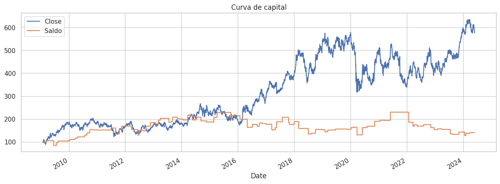

 

  
  <h3 align="center">Trading Sistemático com Machine Learning</h3>
  

    Este repositório apresenta um projeto de Trading Sistemático utilizando algoritmos de Machine Learning, aplicados ao mercado financeiro com a biblioteca <strong>sklearn</strong>.
  

## Introdução ao Trading Sistemático
- Trading Sistemático refere-se ao uso de modelos computacionais e algoritmos para tomar decisões de negociação no mercado financeiro, eliminando o fator emocional e aplicando estratégias baseadas em dados.
- Com o avanço das tecnologias de Machine Learning, é possível desenvolver modelos preditivos que analisam grandes quantidades de dados históricos para identificar padrões e tomar decisões de compra ou venda.

## Metodologia Aplicada
- O código em Python, localizado no notebook main.ipynb, implementa uma estratégia de trading sistemático utilizando técnicas de Machine Learning da biblioteca sklearn.
A estratégia é baseada na criação de modelos preditivos que aprendem com dados históricos de preços e outras variáveis financeiras para prever movimentos futuros de ativos.
- Modelos de aprendizado supervisionado, como Random Forest, Gradient Boosting, e Support Vector Machines (SVM), são treinados e testados com dados históricos para avaliar sua eficácia em prever retornos futuros.

## Sobre o código
- Coleta e Preparação de Dados:
    - Os dados históricos de preços e indicadores financeiros são carregados e pré-processados, incluindo normalização e engenharia de features.

- Treinamento dos Modelos:
    - Vários modelos de Machine Learning são treinados usando técnicas de validação cruzada para garantir que os resultados sejam robustos e não resultem de overfitting.

- Implementação da Estratégia de Trading:
    - O modelo preditivo escolhido é usado para gerar sinais de compra e venda. A estratégia é simulada em um ambiente histórico para avaliar seu desempenho, comparando com uma estratégia de buy-and-hold.

- Avaliação de Desempenho
    - O código avalia a performance do modelo de trading sistemático, gerando métricas como curva de capital, taxa de acerto, retorno acumulado, e volatilidade.

## Resultados e Gráficos
Após a execução do modelo, são gerados gráficos que mostram a Curva de Capital ao longo do tempo, comparando o desempenho da estratégia preditiva com o saldo inicial e outras estratégias de referência.

Gráfico da Curva de Capital

  

